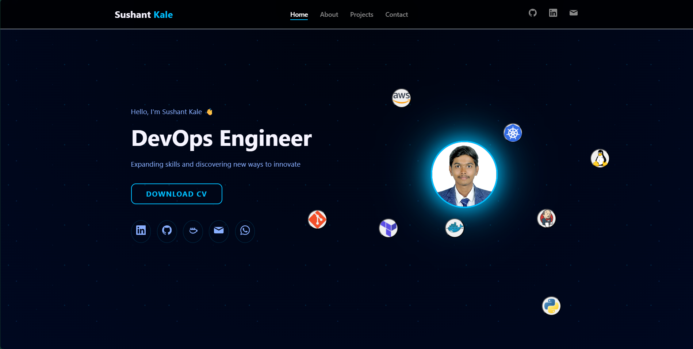

# 🌌 Sushant Kale — Dark Neon Portfolio Website



Welcome to my personal **Portfolio Website**, a modern and visually striking platform that highlights my **skills**, **projects**, and **contact information**.  
Built with passion for design, technology, and automation — the theme features smooth animations, glowing effects, and a futuristic **Dark Neon Blue** aesthetic.

---

## 🚀 Features

✨ **Responsive Design** — Fully optimized for desktops, tablets, and mobile devices  
⌨️ **Typing Effect** — Dynamic animated text to showcase professional roles  
🎨 **Dark Neon Blue Theme** — A modern futuristic interface  
🌍 **Smooth Scrolling Navigation** — Seamless transitions between sections  
⚙️ **Modular Structure** — Clean separation of HTML, CSS, and JS files  
📧 **Contact Form Integration** — Instant message delivery using **Web3Forms**  

---

## 🧠 Tech Stack

| Category | Technologies |
|-----------|---------------|
| **Frontend** |    |
| **Animations & Effects** |   |
| **Form Handling** |  |
| **Deployment** |  |

---

## ⚙️ Setup & Usage

Follow these simple steps to run the project locally:

```bash
# Clone the repository
git clone https://github.com/suskale/Portfolio.git

# Navigate to the project directory
cd Portfolio

# Open the project
Open index.html in your browser
